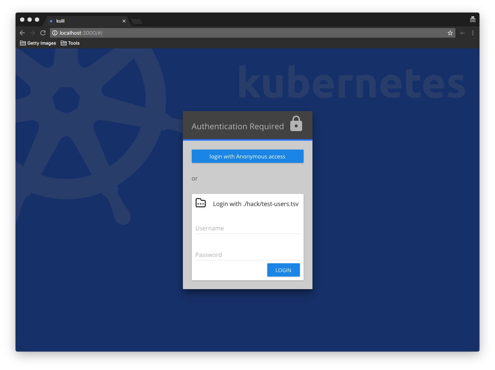
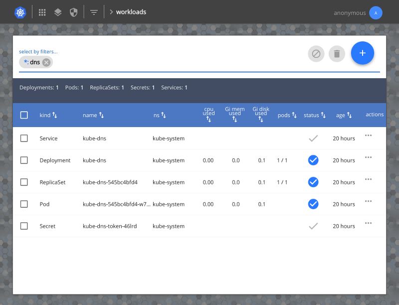
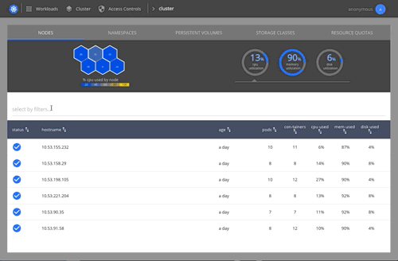
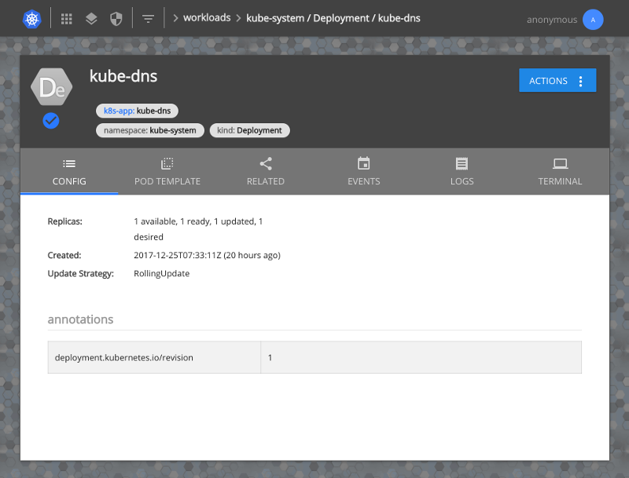
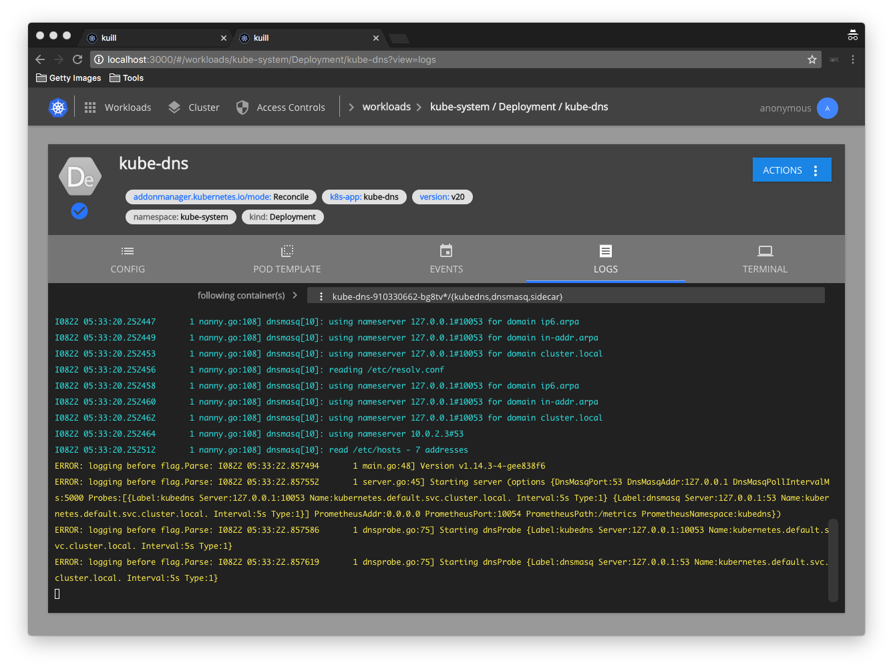
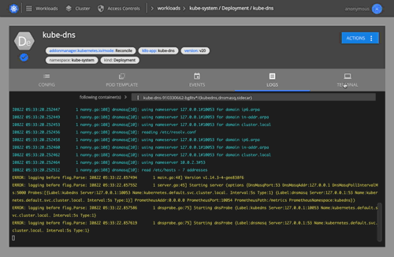

 
===
(_pronounced "kwill"_)

[](https://travis-ci.org/matt-deboer/kuill)
[](https://hub.docker.com/r/mattdeboer/kuill/)

A multitenant UI for kubernetes.

Goal
---

To provide a multi-tennant Kubernetes UI experience (inasmuch as Kubernetes is multi-tennant) capable of integrating with popular enterprise authentication mechanisms, and that helps the casual user come up to speed quickly on the components
that make up their applications.

### Why create another dashboard? Why should I use this one?

The key differentiators when compared with the existing open source dashboard are built-in support for enterprise SSO integrations, combined with the proxying of all requests as the logged-in user (as opposed to executing under a shared service account). See [this discussion](https://github.com/kubernetes/dashboard/issues/574#issuecomment-282360783) for details surrounding the trade-offs involved in running the existing dashboard in a multi-tenant environment.

---

What does it look like? 
---

## Login


## Overview with Summaries for Errors, Events, and Resource Usage


## Filtered Workloads view


## Filtered Nodes View with Heatmap


## Resource


## Multi-container Log Tailing


## Interactive Terminal


---

Test Drive
---

### Getting Started On `minikube`

Prerequisites:

- `minikube`
- `docker`

<div style="padding: 10px; background-color: rgba(99,99,99,0.5);">
TL;DR ? -> clone the repo, and run: &nbsp; <code>hack/test-drive-minikube.sh</code>
</div>
<div style="padding: 10px; background-color: #7a612e;">
TL;DR, and also super-trusting of strangers ? run: &nbsp; <code>sh -c "$(curl -sL https://raw.githubusercontent.com/matt-deboer/kuill/master/hack/test-drive-minikube.sh)"</code>
</div>

1. Start a new `minikube` cluster.

    You'll need to add some additional flags on creation (due to the fact that `kuill` acts
    as an authenticating proxy--configured by flags on the apiserver):

    ```sh
    minikube start \
    --kubernetes-version v1.7.0 \
    --extra-config apiserver.Authorization.Mode=RBAC \
    --extra-config apiserver.Authentication.RequestHeader.AllowedNames=auth-proxy \
    --extra-config apiserver.Authentication.RequestHeader.ClientCAFile=/var/lib/localkube/certs/ca.crt \
    --extra-config apiserver.Authentication.RequestHeader.UsernameHeaders=X-Remote-User \
    --extra-config apiserver.Authentication.RequestHeader.GroupHeaders=X-Remote-Group \
    --extra-config apiserver.Authentication.RequestHeader.ExtraHeaderPrefixes=X-Remote-Extra-
    ```
    _**note**: the command-line flags above are different than would be used to configure the apiserver
    on a standard deployment_


1. Create a clusterrolebinding for kube-system:default service account (allows kube-dns to work in minikube+RBAC)

    ```sh
    kubectl create clusterrolebinding kube-system-admin --clusterrole=cluster-admin --serviceaccount=kube-system:default
    ```

1. Generate certificates for `kuill` using the minikube cluster ca (and a little help from the `cfssl` docker image)

    ```sh
    mkdir -p ~/.minikube/certs/auth-proxy
    ```
    ```sh
    minikube ssh 'sudo cat /var/lib/localkube/certs/ca.key' > ~/.minikube/certs/auth-proxy/ca.key
    ```
    ```sh
    minikube ssh 'sudo cat /var/lib/localkube/certs/ca.crt' > ~/.minikube/certs/auth-proxy/ca.crt
    ```
    ```sh
    docker run --rm \
      -v ~/.minikube/certs/auth-proxy:/certs/auth-proxy \
      -w /certs/auth-proxy --entrypoint sh cfssl/cfssl \
      -c 'echo "{\"signing\":{\"default\":{\"expiry\":\"43800h\",\"usages\":[\"signing\",\"key encipherment\",\"server auth\",\"client auth\"]}}}" > /ca-config.json && \
        echo "{\"CN\":\"auth-proxy\",\"hosts\":[\"\"],\"key\":{\"algo\":\"rsa\",\"size\":2048}}" | \
        cfssl gencert -ca /certs/auth-proxy/ca.crt -ca-key /certs/auth-proxy/ca.key -config /ca-config.json - | \
        cfssljson -bare auth-proxy - && rm -f auth-proxy.csr && rm -f ca.key && mv ca.crt ca.pem'
    ```

1. Create a secret containing the certs (for use by `kuill`)

    ```sh
    kubectl --context minikube create secret generic auth-proxy-certs \
      --from-file  ~/.minikube/certs/auth-proxy -n kube-system
    ```

1. Deploy `kuill`

    ```sh
    curl -sL https://raw.githubusercontent.com/matt-deboer/kuill/master/hack/deploy/kuill-minikube.yml | \
       kubectl --context minikube apply -f -
    ```

1. View it in your browser

    ```sh
    open "https://$(minikube ip):30443/"
    ```

---

Installation
---

See the [Installation](./docs/installation.md) document for details.

---

Developing
---

Run `make minidev` locally to:

1. Spin up (if not already started) a `minikube` setup similar to the test-drive script above.
1. Start a local HMR web dev environment

Code away--PR's welcome!

---

Roadmap:
---

### 1.0 Release (no date yet)

- [ ] General:
  - [ ] Create e2e tests for the most basic features
  - [ ] Working minikube example deployment/guide
  - [ ] Test on GKE deployments--can we even have an authenticating proxy configured?
  - [x] Come up with a better name ! (kuill)
  - [ ] Support for Third Party Resources / Custom Resource Definitions
  - [x] Create/Edit validation for all resources
  - [x] Provide better hints/tool-tips to explain what functions are available, and what they mean
  - [ ] Large scale performance testing (1000's of resources)
  - [ ] Mobile testing/fixes/support

- [ ] Overview/Homepage:
  - [ ] Local storage (or cookies) used to remember previous selected namespaces for a given user
  - [ ] Integrate resource quotas into cluster resource stats
  - [ ] Handling for large numbers of namespaces

- [ ] Workloads:
  - [ ] Test authorization for edit/create/delete actions using kube apis before
        displaying/enabling the associated controls
  - [ ] Provide utilization metrics with pods/deployments/etc., and corresponding summaries by selection
  - [ ] Rollup ReplicaSets under Deployments as "versions"
  - [ ] Rollup Jobs under CronJobs as "runs"

- [ ] Cluster:
  - [x] Use tabs for PersistentVolumes, StorageClasses, TPRs(CustomResources)

- [ ] Access Controls:
  - [ ] Update styles to be consistent with Workloads/Cluster
  - [ ] Add 'Can user X do action Y on resource Z?' button/check to aid with permissions
        checks
  - [x] Add 'What can user X do?' view which lists a summary of a given user's permissions 
